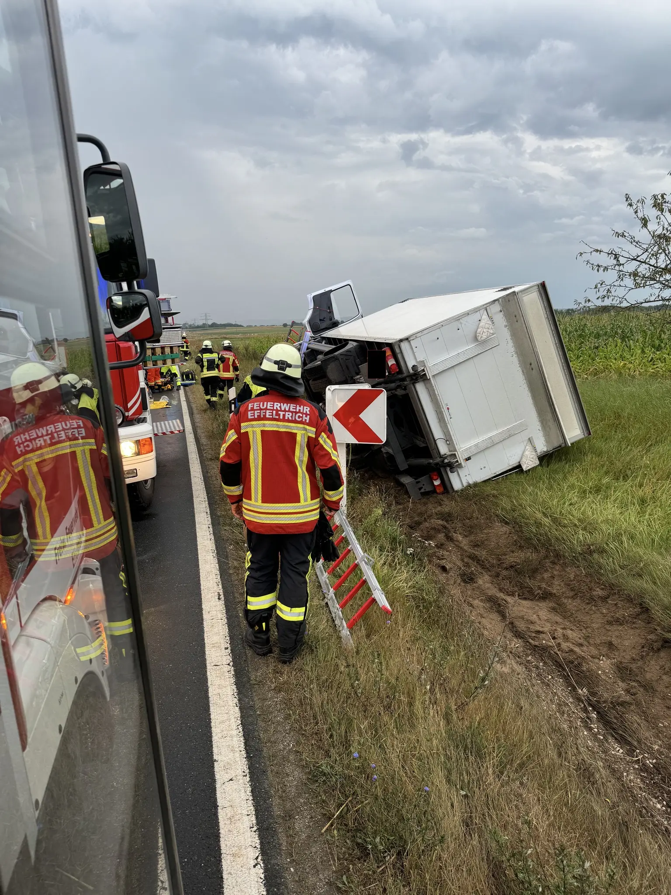
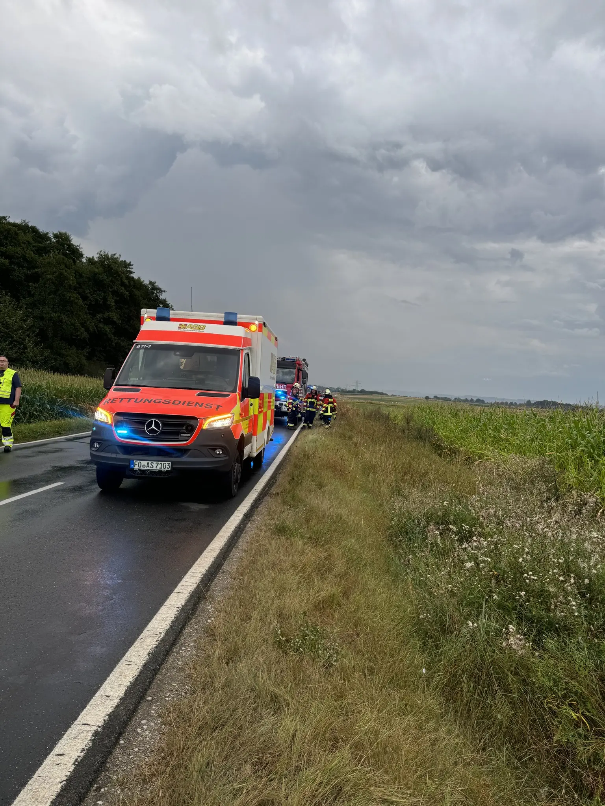

Ein Großaufgebot an Einsatzkräften machte sich am Samstag Morgen kurz nach halb sieben auf den Weg zu einem verunfallten LKW.
Der Fahrer war auf der Staatsstraße zwischen Effeltrich und Neunkirchen kurz nach dem zweiten Abzweig bei Honings von der Fahrbahn abgekommen.
Das Fahrzeug kam im Straßengraben auf der Beifahrerseite zum Liegen.
In Absprache mit der Feuerwehr Neunkirchen befreiten wir den LKW Fahrer mithilfe von Leine und Steckleiter und übergaben ihn an den Rettungsdienst.
Um sicher arbeiten zu können sperrten wir die Straße mit mehreren Posten bereits von Effeltrich aus für den Verkehr.
Im weiteren Verlauf übernahmen die Einsatzkräfte der FF Neunkirchen die Verkehrsabsicherung bis zur Bergung des Fahrzeugs. Unsere 15 Einsatzkräfte konnten im Anschluss zeitig in ihren Sommersamstag starten.

