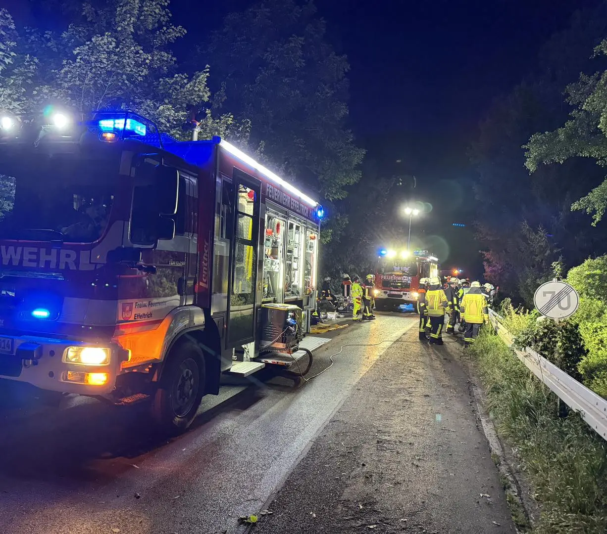
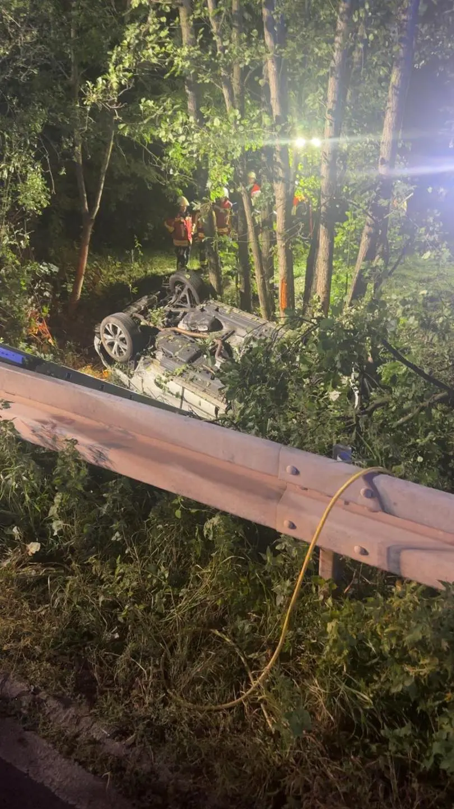
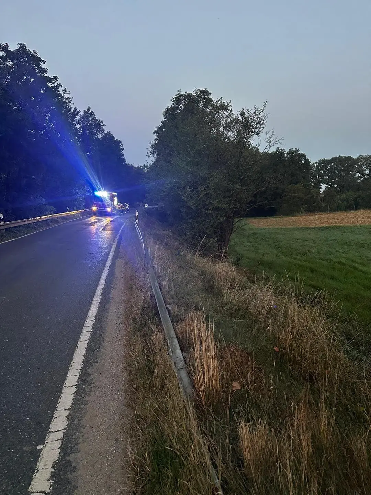

In der Nacht von Freitag auf Samstag ereignete sich auf der Straße zwischen Effeltrich und Gaiganz ein schwerer Verkehrsunfall.
Ein Fahrzeug kam von der Fahrbahn ab und landete auf dem Dach im stark bewachsenen, deutlich tieferliegenden Graben neben der Straße.
Im Fahrzeug befanden sich zwei Personen während des Unfalls.
Eine Person hatte beim Eintreffen der Feuerwehr das Auto bereits selbst verlassen können. Eine weitere Person befand sich schwer verletzt im PKW.  In Zusammenarbeit mit dem Rettungsdienst wurde sie versorgt, befreit und ins Krankenhaus verbracht.
Hierfür musste zunächst ein Zugang zur Einsatzstelle und dann zum Verletzten erkundet werden. Die schwer erreichbare Arbeitsstelle wurde dann mittels Kettensäge frei geschnitten und entsprechend ausgeleuchtet.
Bei diesen Einsatz stellten neben der Unfallsituation sicherlich der erschwerte Zugang sowie die entsprechenden Geländeverhältnisse vor Ort Herausforderungen für die Einsatzkräfte dar. Die Gerätschaften mussten über die Böschung hinab und über den Graben zum Ort des Geschehens gebracht werden. Der Patient entsprechend nach oben zum Rettungswagen.

Abschließend barg der Abschleppdienst das stark zerstörte Fahrzeug, so dass die für die Dauer der Maßnahmen gesperrte Staatsstraße gegen 7 Uhr wieder für den Verkehr freigegeben werden konnte.

Mit uns in Einsatz waren die
[Feuerwehr Langensendelbach](http://www.ff-langensendelbach.de/) & die
Feuerwehr Kunreuth - sowie Polizei & Rettungsdienst

Danke an alle eingesetzten Kräfte 🚒🚑🚓

