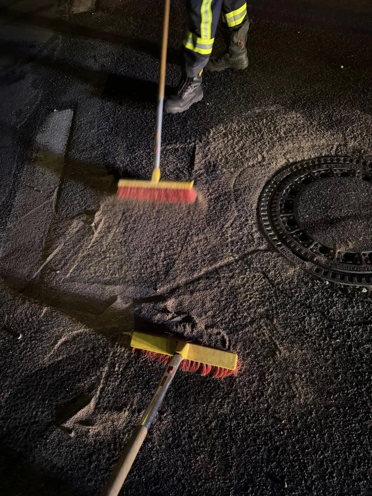
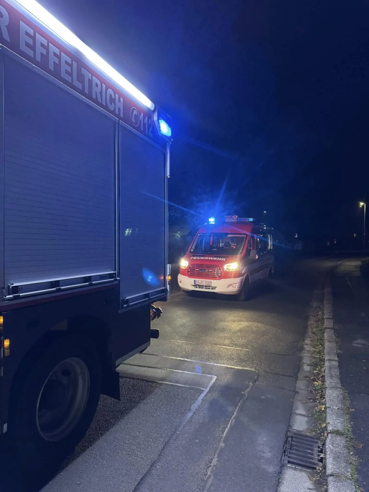

**THL 1 Straße reinigen** - so hieß unser Einsatzstichwort heute um kurz nach 18 Uhr. Die zuerst klein gedachte Ölspur entpuppte sich als eine sehr lange Spur die sich von Effeltrich bis nach Pinzberg zog.

Mit 24 starken Händen haben wir wir Straße für die Verkehrsteilnehmer schnell wieder sicher gefegt 🧹
Nach ca. 1 1/2 Stunden konnten wir wieder in unser Feuerwehrhaus zurückkehren und die Einsatzstelle an den Bereitschaftsdienst des Bauamts übergeben.

