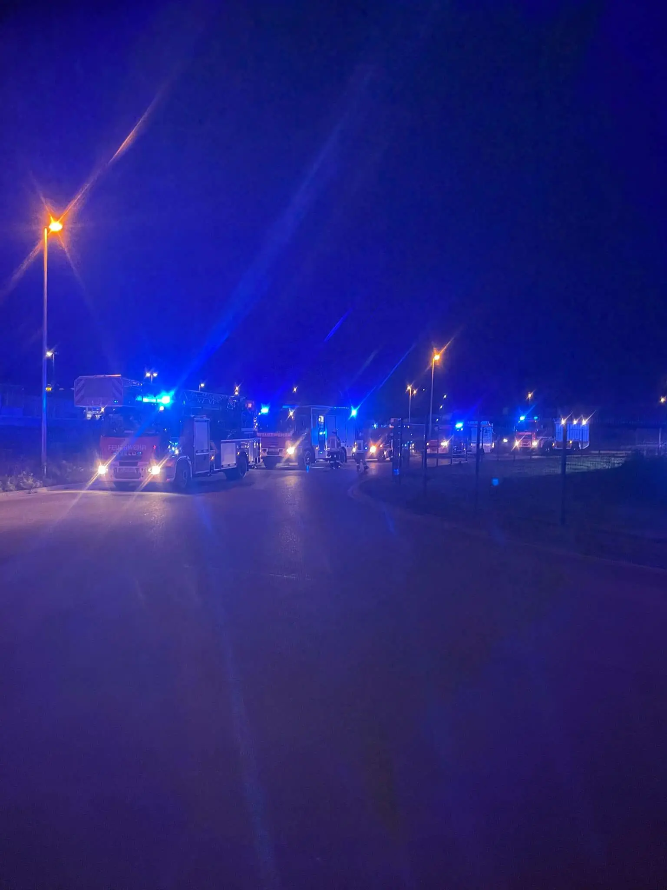

Am späten Freitag Abend, 20.12.24, alarmierte es mehrere Feuerwehren im Umkreis nach Kersbach. In einem größeren Betrieb des Industriegebietes war ein Feuer ausgebrochen- weshalb entsprechend Mannschaft und Gerät an die Einsatzstelle geordert wurde. Das Feuer konnte glücklicherweise schnell unter Kontrolle gebracht werden und entsprechende Lüftungsmaßnahmen wurden eingeleitet.

Nach etwa 1 Stunde in Bereitstellung zur Sicherung des möglichen Bedarfs an Atemschutzgeräteträgern konnten wir wieder einrücken.
