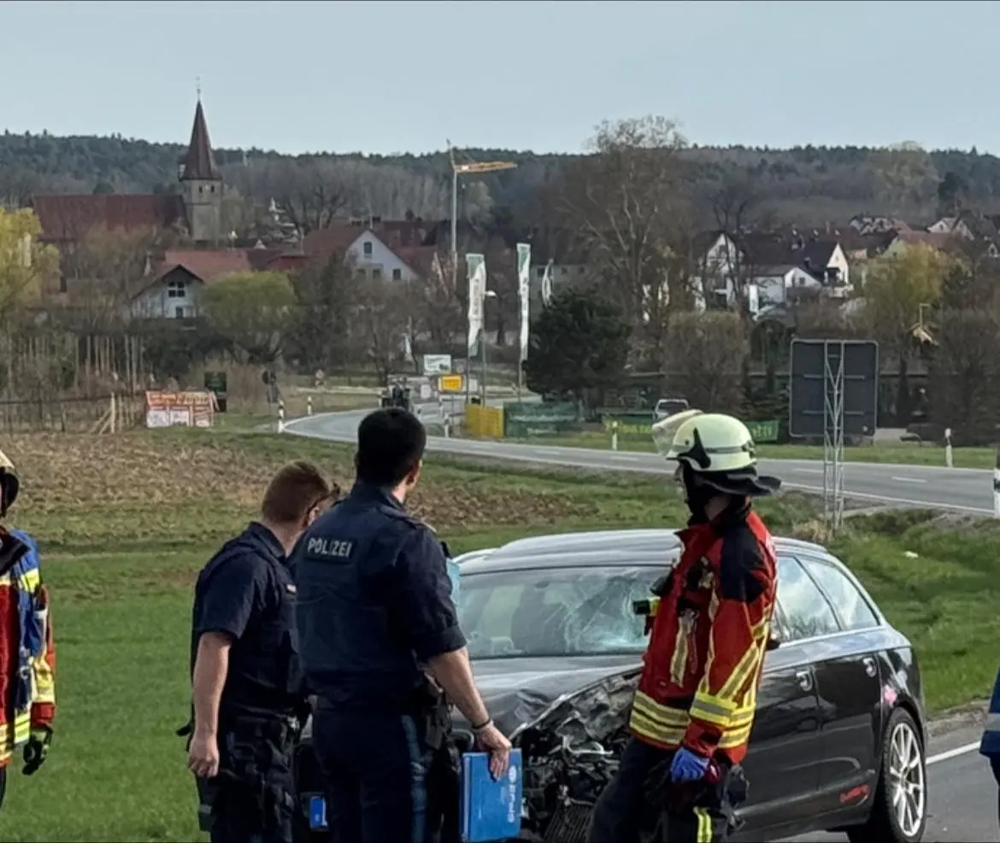
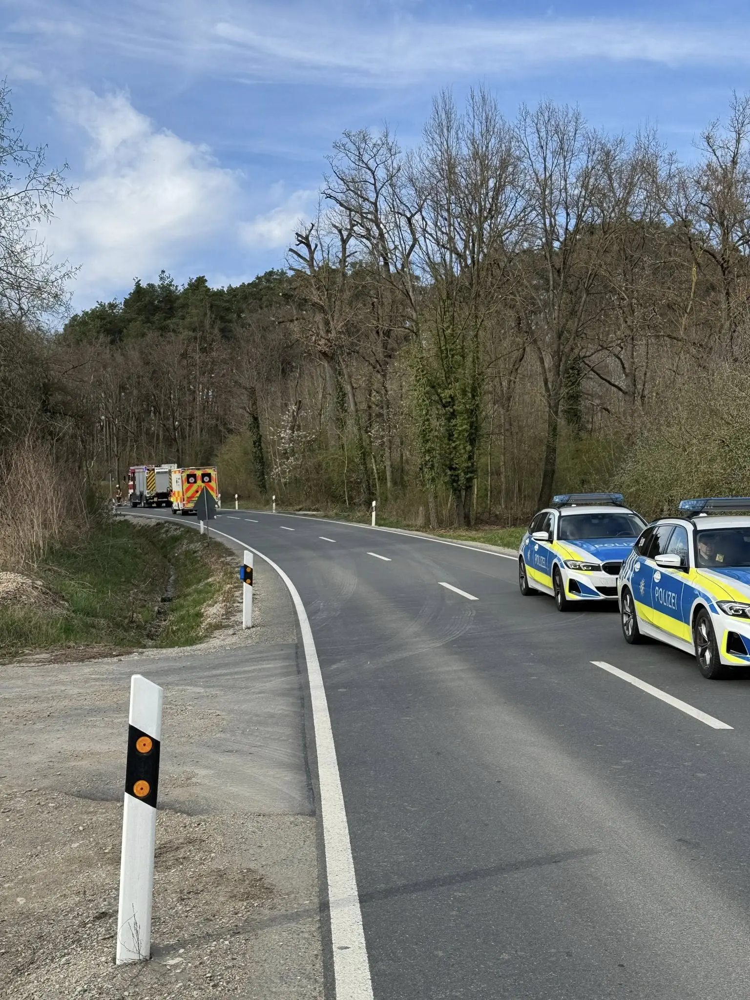

Am späten Samstagnachmittag (5.4.2025) kam es kurz vor dem Ortseingang Effeltrich zu einem Verkehrsunfall zwischen einem Motorrad und einem mit zwei Personen besetztem PKW.
Die Straße wurde für die Dauer der Einsatzmaßnahmen und Unfallaufnahme komplett gesperrt. Weiterhin unterstützten wir die Patientenversorgung und reinigten die Fahrbahn.
Der Motorradfahrer wurde in ein Krankenhaus gebracht. Die PKW Insassen blieben unverletzt.

Nach knappen 2 Stunden war der Einsatz für uns beendet und die Straße wieder frei.

