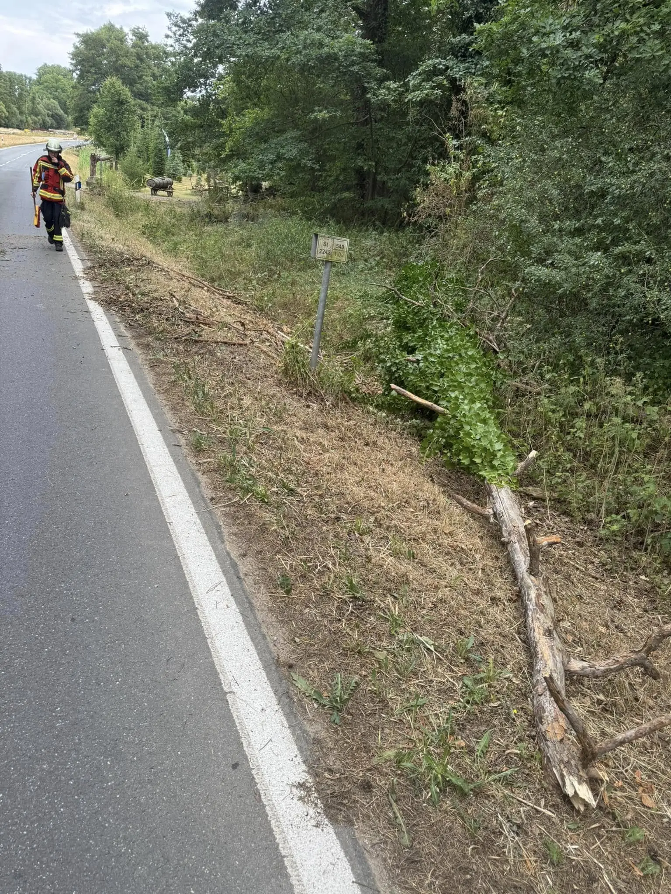

Heute wurden wir um 14:20 Uhr zu einem umgestürzten Baum alarmiert. Gemeldet war ein „Baum auf Straße“ auf der Ortsverbindungsstraße Effeltrich – Gaiganz.
An der Einsatzstelle angekommen fanden wir nur noch eine Verschmutzung der Fahrbahn vor. Passanten hatten den Baum bereits auf die Seite gezogen. Wir reinigten die Straße und konnten den Einsatz im Anschluss beenden.

