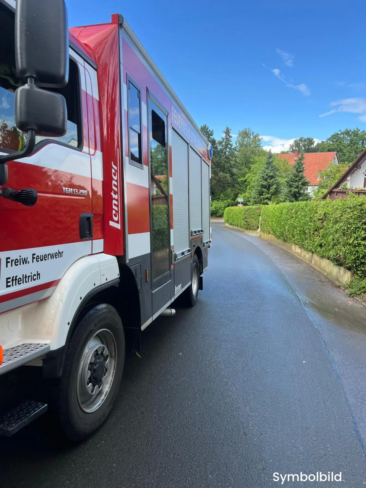

Am Dienstag (22.7.25) wurde die Feuerwehr Effeltrich unter dem Stichwort „THL 1 Wasser im Keller“ alarmiert.
Um 16:16 Uhr rückten 7 Brandschützer mit unserem Hilfeleistungslöschfahrzeug aus. Die teils sehr starken Regenschauer an diesem Tag hatten einen Lichtschacht volllaufen lassen. Vor Ort wurden wir nicht tätig und konnten den Einsatz nach einer knappen halben Stunde beenden.

Wir möchten die Gelegenheit nutzen auf das Infoblatt des BBK (Bundesamt für Bevölkerungsschutz und Katastrophenhilfe) hinzuweisen, welches die Vorsorgemassnahmen zum Thema Hochwasser (auch bedingt durch Starkregen) aufgreift und entsprechende Handlungsanweisungen enthält.
Dieses ist zu finden unter:

## [Flyer-Hochwasser (Klick für Download)](/documents/flyer-hochwasser.pdf)
