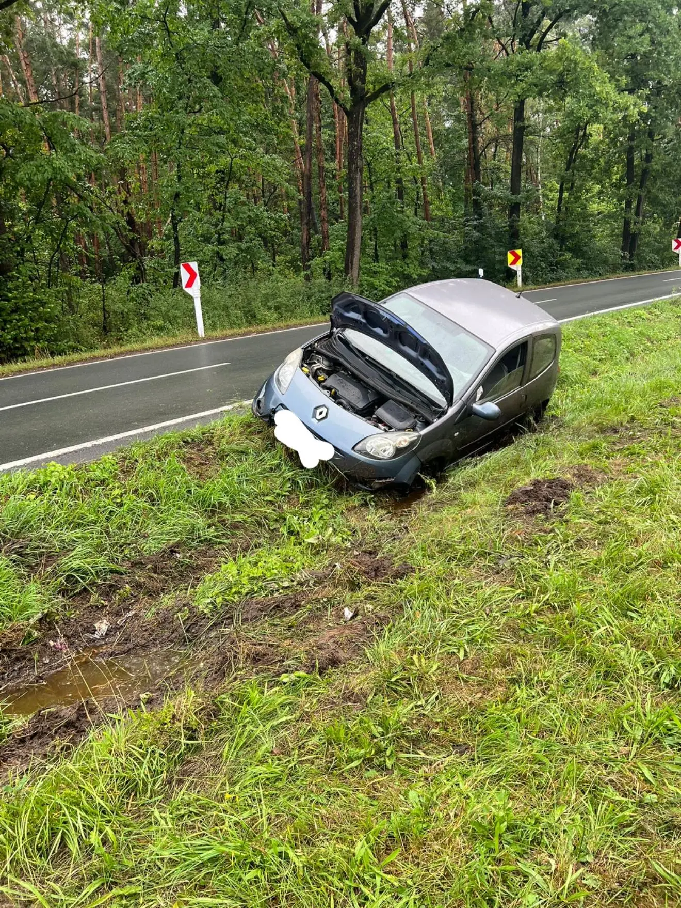
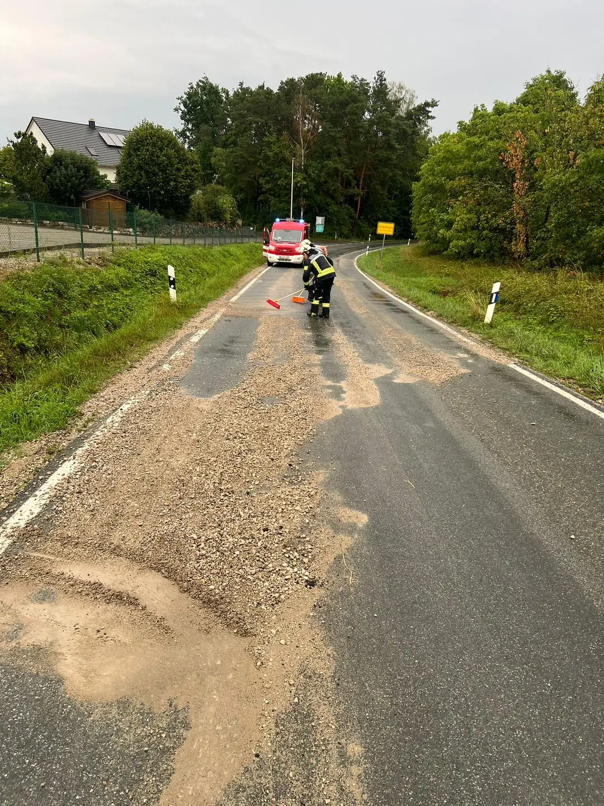

Gleich zwei parallele Einsätze beschäftigten die Feuerwehr am Samstagabend.
Ein Unfall auf der Staatsstraße zwischen Honings und Effeltrich sowie eine verschmutzte Fahrbahn am Ortseingang von Langensendelbach kommend.

Die Einsatzstelle mit dem Unfall übernahm eine Gruppe mit dem Hilfeleistungslöschfahrzeug. Ein Pkw war in einer scharfen Kurve von der regennassen Straße abgekommen und auf der Seite liegen geblieben. Beim Eintreffen der Feuerwehr waren Polizei und Rettungsdienst schon vor Ort und keine Person mehr im Pkw. So sicherten wir lediglich die Unfallstelle für die Unfallaufnahme ab und kontrollierten zwecks ausgelaufener Betriebsstoffe.
Während dieses Einsatzes meldete der ebenfalls anfahrende Kreisbrandmeister eine stark verschmutzte Fahrbahn auf Höhe des Autohauses am Ortseingang.

Der MTW machte sich mit vier Feuerwehrlern auf den Weg zur zweiten Einsatzstelle.
Dort hatte starker Regen Schotter auf die Fahrbahn gespült. Da dies eine unmittelbare Gefahr darstellte, kehrten die Einsatzkräfte die Fahrbahn frei.

Das Regenwetter im Juli hat uns schon so manchen Einsatz beschert - passt auf euch auf und fahrt vorsichtig!!!

