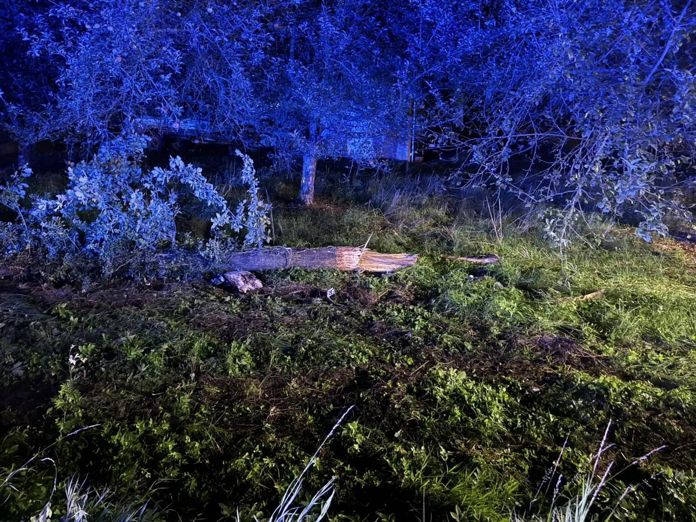
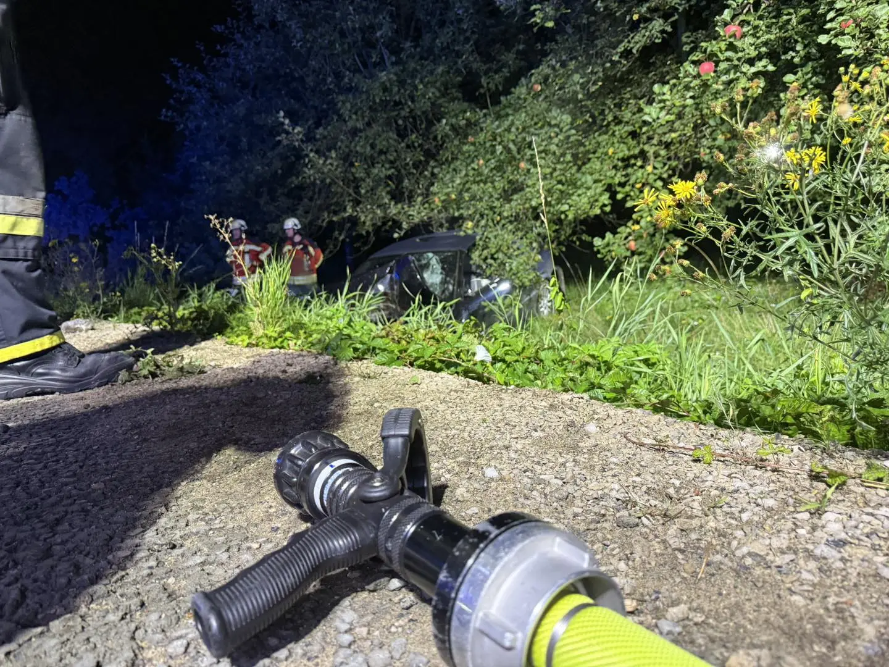
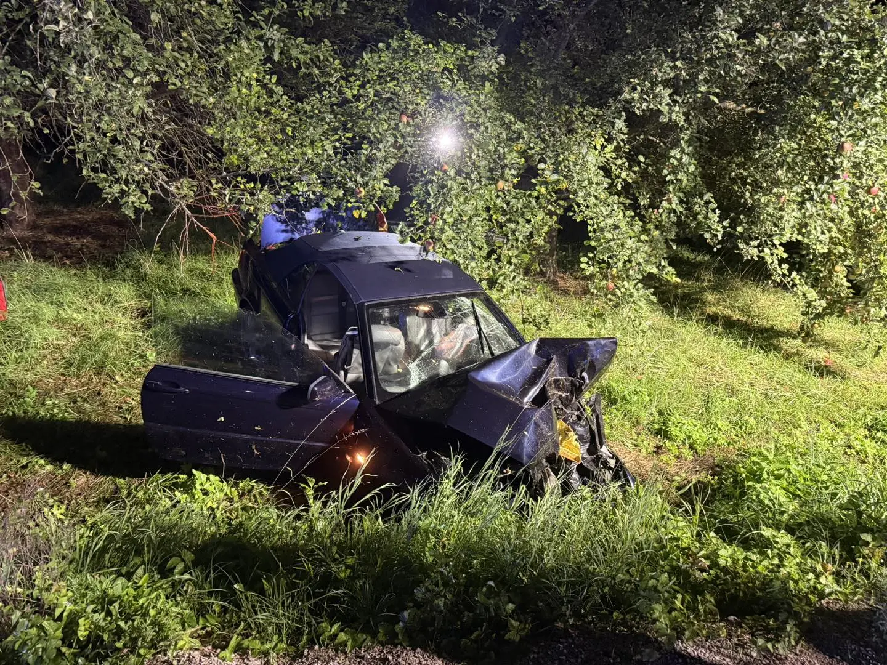

Am späten Dienstag Abend (16.9.25) heulten die Sirenen in Effeltrich und Langensendelbach. Die Erstmeldung lautete Verkehrsunfall mit mehreren PKW- Anforderung zum Ausleuchten der Einsatzstelle.

Am Unfallort angekommen übernahmen wir sofort die Verkehrsabsicherung sowie das Ausleuchten der Einsatzstelle für die Unfallaufnahme. Der Rettungsdienst war bereits mit mehreren Fahrzeugen vor Ort, ebenso die Polizei. Alle Fahrzeuginsassen konnten das Fahrzeug verlassen und wurden bereits rettungsdienstlich versorgt.
Der Fahrer eines Cabriolets mit drei Mitfahrern war von der Fahrbahn abgekommen, hatte auf dem Seitenstreifen bereits einen Baum gestreift und einen anderen durch den Aufprall „gefällt“.
Wir stellten im weiteren Verlauf den Brandschutz sicher, suchten aufgrund der Erstmeldung das Umfeld mittels Wärmebildkamera ab und reinigten die Straße von Blättern und Ästen. Die Feuerwehr Langensendelbach unterstütze beim Ausleuchten der weiträumigen Unfallstelle.

Nach gut zwei Stunden war der Einsatz beendet und die Einsatzkräfte konnten einrücken.

