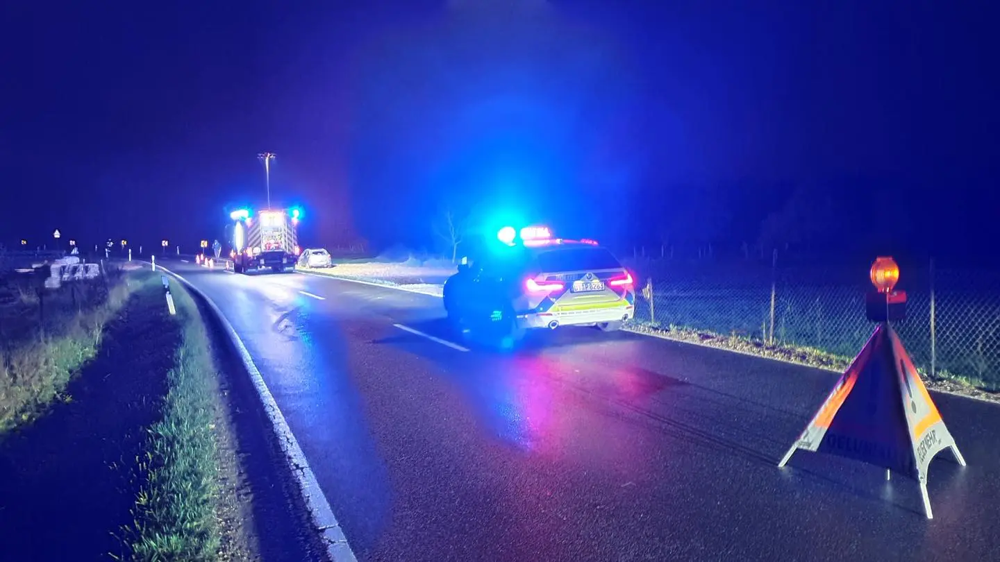
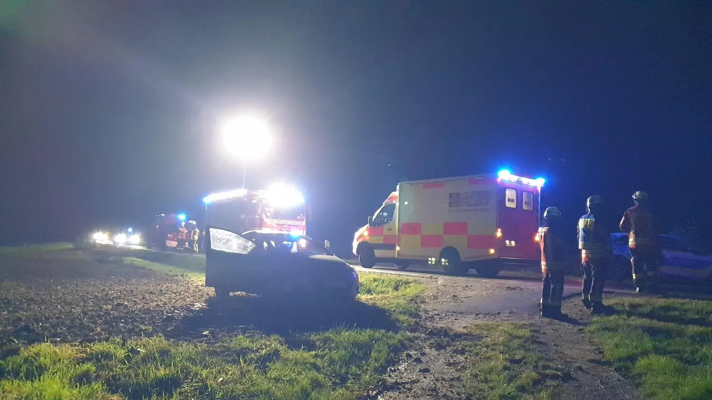
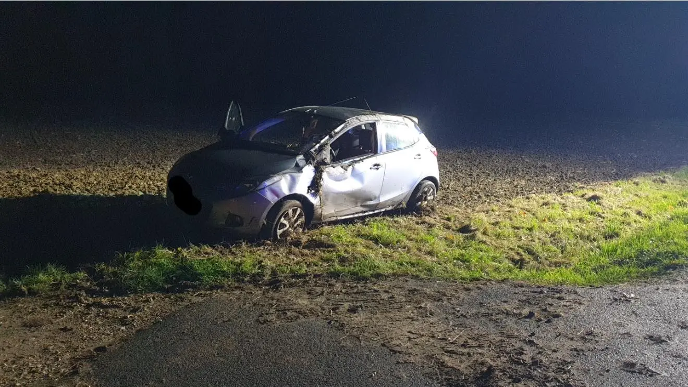

Auf der bekannten Strecke, der Staatsstraße zwischen Effeltrich und Honings, kam es in der Nacht von Allerheiligen auf Allerseelen zu einem Verkehrsunfall eines Kleinwagens. Um 0:14 Uhr (2.11.25) schrillten die Sirenen in Effeltrich.

Wir trafen nach kurzer Anfahrt als Erstes am Einsatzort ein und übernahmen umgehend die Erstversorgung des Unfallopfers bis zum Eintreffen des Rettungsdienstes. Das Fahrzeug war in einer scharfen Rechtskurve nach links von der regennassen Fahrbahn abgekommen und hatte sich gedreht und überschlagen. Am Ende stand der Kleinwagen wieder auf seinen 4 Rädern.
Der Rettungsdienst brachte die Fahrzeuginsassin ins Krankenhaus.

Das erste Meldebild - Person im Fahrzeug eingeschlossen bestätigte sich nicht- Ersthelfer hatten die Türe bereits geöffnet! Danke 🙏
Wir leuchteten weiterhin die Unfallstelle aus und sicherten diese gegen den fließenden Verkehr.

Nach guten 2 Stunden war der Einsatz für die 14 Einsatzkräfte beendet.

