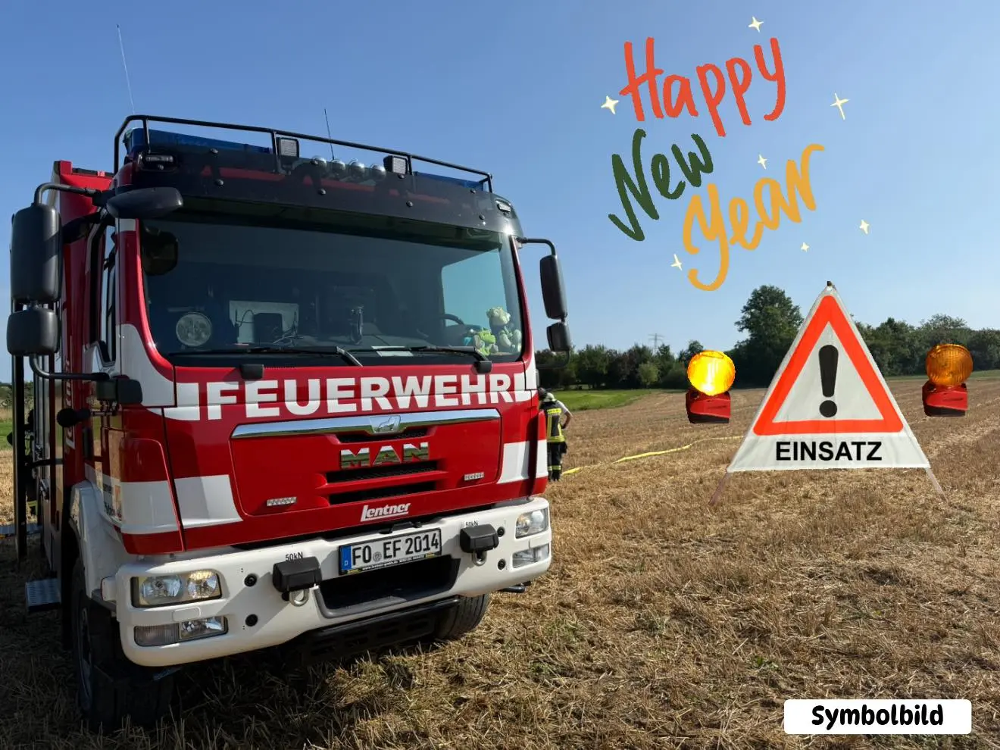

Zum ersten Einsatz des neuen Jahres wurden wir bereits um kurz nach 1 Uhr heute Morgen alarmiert - Stichwort B3- im Gebäude/Garage.
Gut besetzt mit Atemschutzgeräteträgern machten wir uns auf den Weg nach Kersbach.
Glücklicherweise brannte dort „nur“ eine Mülltonne - allerdings in einem Carport. Kein Problem für die Kersbacher Kameraden, so dass unsere Unterstützung am Ende nicht benötigt wurde.

Noch vor 2 Uhr waren wir wieder zurück und konnten selbst noch ein wenig das neue Jahr begrüßen.

Wir wünschen euch allen ein wunderbares gesundes glückseliges neues Jahr 2026! 🍄🍀⭐️
