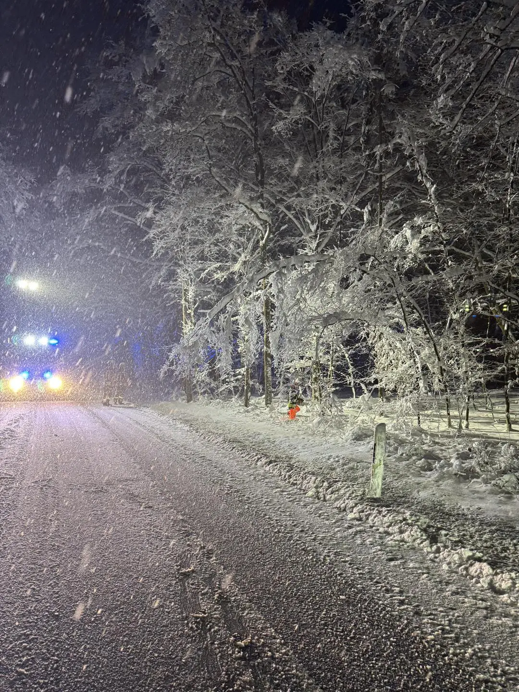
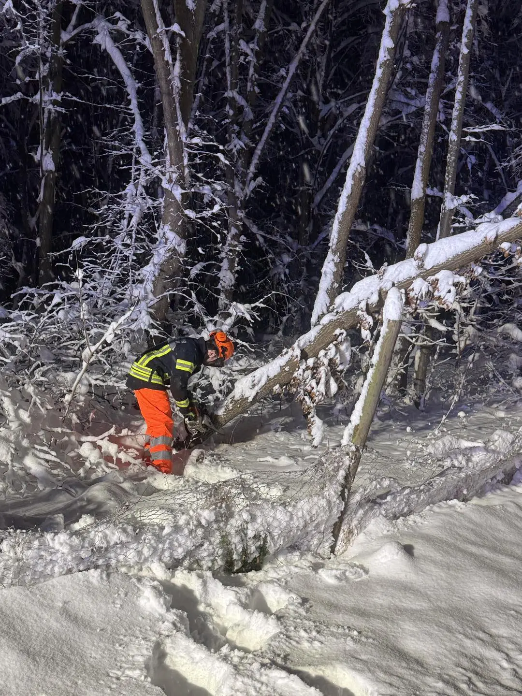
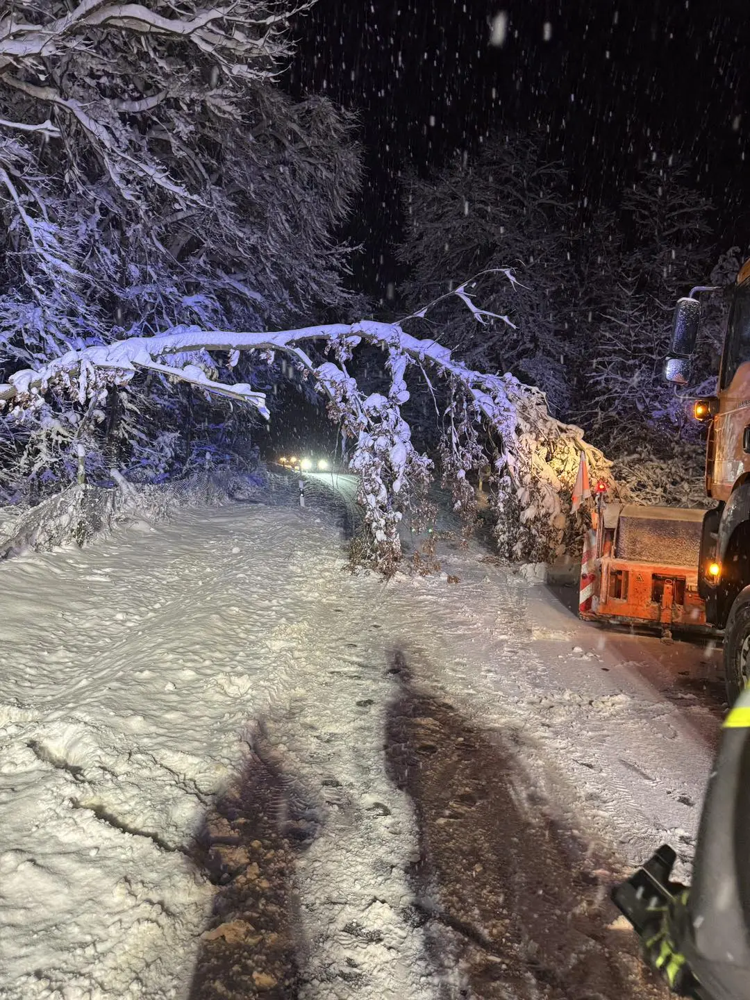

Die Vorhersage extremer Schneefälle für unsere Region, die der deutsche Wetterdienst für Montag herausgegeben hatte, hat sich bewahrheitet.
30cm und mehr fielen in etwa 24 Stunden und legten den Verkehr teilweise lahm.
Im Laufe des Montages wurde im Landkreis Forchheim schlussendlich auch KATWARN ausgelöst.
Die Schneemassen lasteten hart auf den Zweigen der Bäume.
So einige Äste und Bäume hielten dem Gewicht nicht stand.

Im Verlauf des Montags wurden im ganzen Landkreis die Feuerwehren aktiv und Straßen durch Waldgebiete wurden gesperrt.
Auch die Feuerwehr Effeltrich wurde zu 4 Einsätzen wegen Schneebruchs gerufen, die unter sehr winterlichen Bedingungen abgearbeitet werden mussten.

Mittlerweile verbessert sich die Situation durch das Tauwetter und die damit verbundene Entlastung der Äste und Bäume.
Dennoch ist Vorsicht geboten und gerade durch Spaziergänger sollten Waldgebiete eher gemieden werden. Der Boden weicht auf und die Bäume können weiterhin fallen.

Passt auf euch auf !

